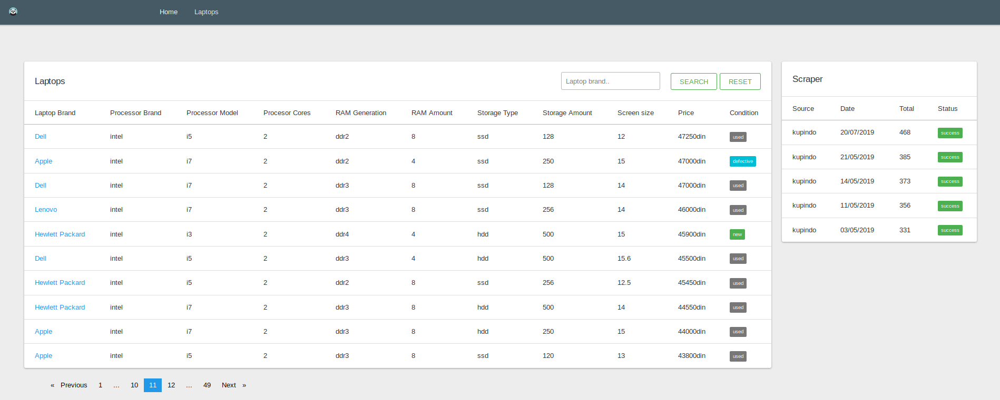
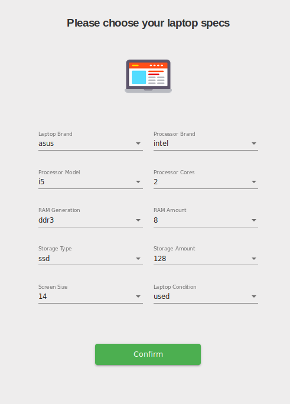
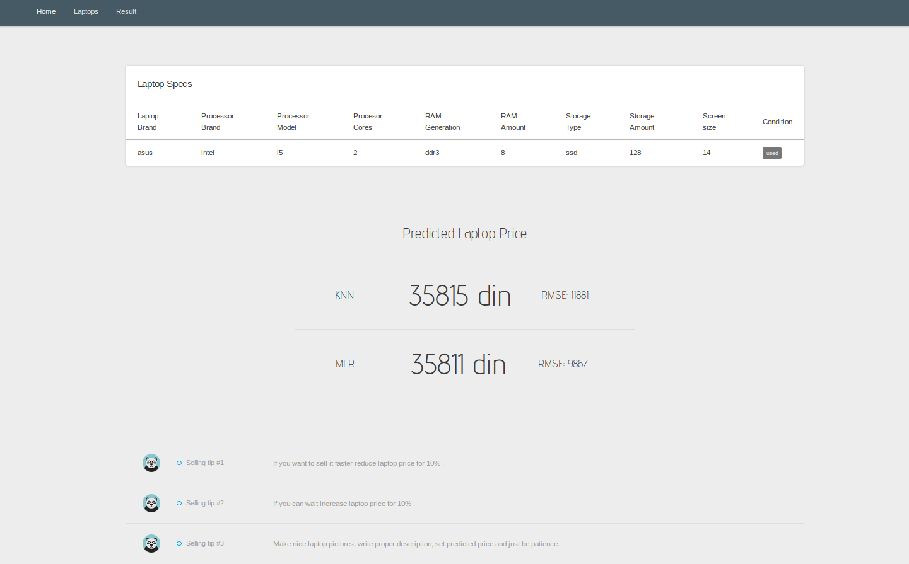

# Predict Laptop Price

<h4> Server App </h4>

- Language: Java
- Framework: Spring with MVC architecture
- Project management tool: Maven
- Database: PostgreSQL

<h4> Client App </h4>

- Framework: Angular
- Some features:
    - Preview and filter all laptops
    - Preview scraper status
    - Choose your laptop specs
    - See predicited Laptop prices

<h4> Prediction API </h4>

- Framework: Django
- Machine Learning methods used for prediction:
    - Multiple Linear Regression (MLR)
    - K-Nearest neighbors (KNN)

<h4> Data Scrapper </h4>

- Language: Python
- Framework: Selenium
- Library: BeautifulSoup
- PostgreSQL adapter: Psycopg
- Collects as many as possible laptops from website <a href="https://www.kupindo.com/" target="_blank"> kupindo.com</a>
    - Insert collected data into DB

<h4> Deployment </h4>
 
- Docker
- AWS EC2

 
  
  
  

### Preview laptops and scraper status

<h3 align="center"> Choose laptop specs </h3>

 

### App result

